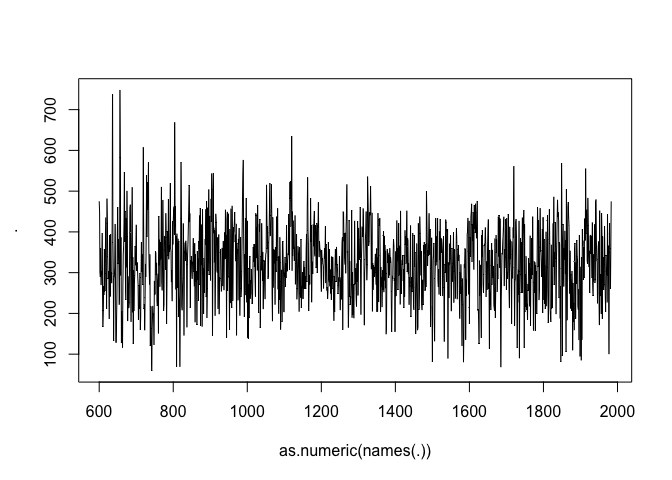
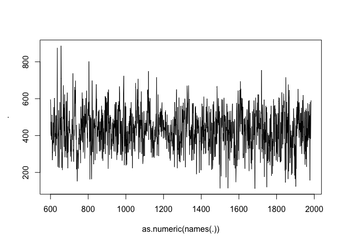
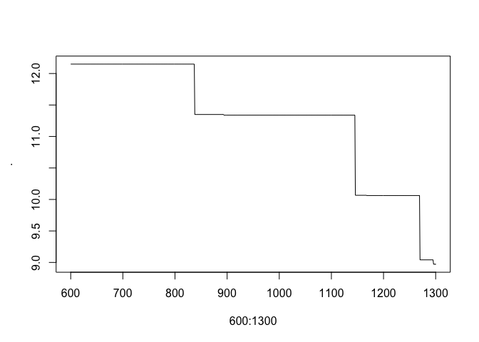
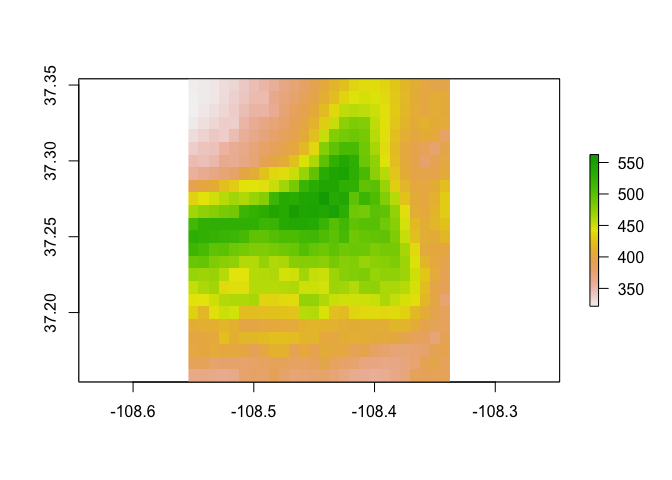
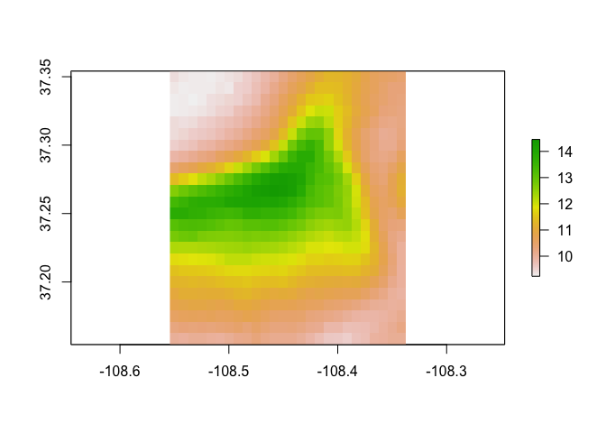
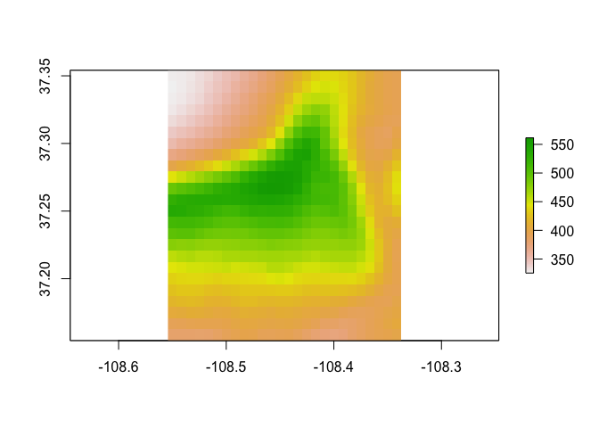

paleocar
========

[](https://travis-ci.org/bocinsky/paleocar) <!-- [](https://github.com/metacran/cranlogs.app) --> [](https://cran.r-project.org/package=paleocar)

`paleocar` is an *R* package implementing functions to perform spatio-temporal paleoclimate reconstruction from tree-rings using the CAR (Correlation Adjusted corRelation) approach of Zuber and Strimmer as implemented in the [`care` package](https://CRAN.R-project.org/package=care) for *R*. It is optimized for speed and memory use.

This is based on the approach used in Bocinsky and Kohler (2014):

Bocinsky, R. K. and Kohler, T. A. (2014). A 2,000-year reconstruction of the rain-fed maize agricultural niche in the US Southwest. *Nature Communications*, 5:5618. doi: [10.1038/ncomms6618](http://www.nature.com/ncomms/2014/141204/ncomms6618/full/ncomms6618.html).

The primary difference between the latest version of `paleocar` and that presented in Bocinsky and Kohler (2014) is, here, model selection is performed by minimizing the corrected Akaike's Information Criterion.

A more recent reference would be Bocinsky et al. (2016):

Bocinsky, R. K., Rush, J., Kintigh, K. W., and Kohler, T. A. (2016). Exploration and exploitation in the macrohistory of the pre-Hispanic Pueblo Southwest. *Science Advances*, 2:[e1501532](http://advances.sciencemag.org/content/2/4/e1501532).

This package has been built and tested on a source (Homebrew) install of *R* on macOS 10.12 (Sierra), and has been successfully run on Ubuntu 14.04.5 LTS (Trusty), Ubuntu 16.04.1 LTS (Xenial) and binary installs of *R* on Mac OS 10.12 and Windows 10.

### Development

-   [Kyle Bocinsky](http://bocinsky.io) - Crow Canyon Archaeological Center, Cortez, CO

### Install `paleocar`

-   Development version from GitHub:

    ``` r
    install.packages("devtools")
    devtools::install_github("bocinsky/paleocar")
    library(paleocar)
    ```

-   Linux (Ubuntu 14.04.5 or 16.04.1):

First, in terminal:

``` bash
sudo add-apt-repository ppa:ubuntugis/ppa -y
sudo apt-get update -q
sudo apt-get install libssl-dev libcurl4-openssl-dev netcdf-bin libnetcdf-dev gdal-bin libgdal-dev
```

Then, in R:

``` r
update.packages("survival")
install.packages("devtools")
devtools::install_github("bocinsky/paleocar")
library(paleocar)
```

### Demonstration

This demo script is available in the `/inst` folder at the location of the installed package.

#### Load `paleocar` and set a working directory

``` r
library(paleocar)
library(magrittr) # The magrittr package enables piping in R.

# Set a directory for testing
testDir <- "~/paleocar Test"
# and create it if necessary
dir.create(testDir, showWarnings=F, recursive=T)
```

#### Load test datasets

`paleocar` ships with test files defining a study area (Mesa Verde National Park), and pre-extracted data from the International Tree Ring Databank using the [`FedData` package](https://github.com/bocinsky/FedData). See the `data-raw/data.R` script (or the documentation for `FedData`) to learn how to download these data.

``` r
# Load spatial polygon for the boundary of Mesa Verde National Park (MVNP) in southwestern Colorado:
data(mvnp)

# Get Tree-ring data from the ITRDB for 10-degree buffer around MVNP
data(itrdb)

# Get 1/3 arc-second PRISM gridded data for the MVNP north study area
data(mvnp_prism)
```

#### Run `paleocar`

`paleocar` can be run for either single location given by a vector of annualized climate data, a matrix of locations, or over gridded climate data such as PRISM in raster format. There are three primary functions:

-   `paleocar_models()` calculates the CAR-ranked linear models for all reconstructions
-   `predict_paleocar_models()` generates climate predictions over a specified prediction period, and
-   `uncertainty_paleocar_models()` generates an estimate of model uncertainty over a specified prediction period.

Finally, the `paleocar()` method is a convenience wrapper that runs all three of these functions and returns a list with their output. See the documentation for each function for details.

##### `paleocar` reconstruction for a single location

`paleocar` may be run for a single location by providing a vector of annualized values to be reconstructed. Simply provide a numeric vector the same length as your calibration years as the `predictands` parameter.

``` r
# Extract a vector of annualized climate data (the first cell in the raster)
mvnp_prism.vector <- mvnp_prism[1][1,]

test.vector <- paleocar_models(predictands = mvnp_prism.vector,
                               chronologies = itrdb,
                               calibration.years = 1924:1983,
                               prediction.years = 1:2000,
                               verbose = T)
```

    ## Calculating PaleoCAR models
    ## 
    ## Prepare data and calculate CAR scores: 0.01 minutes
    ## 
    ## Calculating models of with 1 input vectors.
    ## Define models: 0.02 minutes
    ## Calculate 5 linear models: 0 minutes
    ## Clean linear models: 0 minutes
    ## Total modeling time: 0.02 minutes
    ## 123 cell-years remaining
    ## 
    ## Calculating models of with 2 input vectors.
    ## Define models: 0.02 minutes
    ## Calculate 7 linear models: 0 minutes
    ## Clean linear models: 0 minutes
    ## Total modeling time: 0.02 minutes
    ## 115 cell-years remaining
    ## 
    ## Calculating models of with 3 input vectors.
    ## Define models: 0.02 minutes
    ## Calculate 7 linear models: 0 minutes
    ## Clean linear models: 0 minutes
    ## Total modeling time: 0.02 minutes
    ## 41 cell-years remaining
    ## 
    ## Calculating models of with 4 input vectors.
    ## Define models: 0.01 minutes
    ## Calculate 6 linear models: 0 minutes
    ## Clean linear models: 0 minutes
    ## Total modeling time: 0.02 minutes
    ## 13 cell-years remaining
    ## 
    ## Calculating models of with 5 input vectors.
    ## Define models: 0.01 minutes
    ## Calculate 2 linear models: 0 minutes
    ## Clean linear models: 0 minutes
    ## Total modeling time: 0.01 minutes
    ## 3 cell-years remaining
    ## 
    ## Calculating models of with 6 input vectors.
    ## Define models: 0.01 minutes
    ## Calculate 1 linear models: 0 minutes
    ## Clean linear models: 0 minutes
    ## Total modeling time: 0.01 minutes
    ## 
    ## Total Modeling Time: 0.1077937 minutes
    ## 
    ## Optimizing models: 0 minutes

``` r
# Generate predictions and uncertainty (and plot timeseries of each)                             
predict_paleocar_models(models = test.vector,
                        meanVar = "chained",
                        prediction.years = 600:1300) %>%
  plot(x = as.numeric(names(.)),
       y = .,
       type = "l")
```

    ## Warning in predict_paleocar_models(models = test.vector, meanVar
    ## = "chained", : Chained mean-variance matching requires that the
    ## prediction.years include the calibration period. Changing prediction years
    ## to include calibration period.



``` r
uncertainty_paleocar_models(test.vector,
                            prediction.years = 600:1300) %>%
  plot(x = as.numeric(names(.)),
       y = .,
       type = "l")
```


##### `paleocar` reconstruction for multiple locations using the same set of predictors (in this case, tree-ring chronologies)

Running `paleocar` on a matrix of locations (`predictands`) will generate reconstructions that select from the same set of predictors (`chronologies`). The matrix must be formatted such that each location is in a column, and each row is a year of data. Note that the number of rows of the matrix must be the same as the number of years provided to `calibration.years`.

``` r
# Extract a matrix of annualized climate data (all cells in the raster)
mvnp_prism.matrix <- mvnp_prism %>%
  raster::as.matrix() %>% 
  t()

# Print to show format
mvnp_prism.matrix %>% 
  tibble::as_tibble()
```

    ## # A tibble: 60 × 624
    ##       V1    V2    V3    V4    V5    V6    V7    V8    V9   V10   V11   V12
    ##    <dbl> <dbl> <dbl> <dbl> <dbl> <dbl> <dbl> <dbl> <dbl> <dbl> <dbl> <dbl>
    ## 1    291   291   291   294   297   301   304   309   314   318   324   333
    ## 2    364   364   368   371   375   382   389   395   404   409   420   427
    ## 3    387   388   390   394   398   403   408   413   424   427   436   443
    ## 4    506   507   510   516   521   530   539   547   556   563   574   582
    ## 5    254   254   257   258   261   268   269   278   284   285   293   298
    ## 6    436   437   439   443   451   459   469   478   490   498   508   521
    ## 7    259   261   263   266   271   275   284   289   297   301   308   315
    ## 8    290   290   289   292   295   298   299   300   304   308   314   318
    ## 9    419   419   421   426   431   437   442   449   455   461   470   479
    ## 10   239   243   245   249   254   260   265   272   279   284   292   297
    ## # ... with 50 more rows, and 612 more variables: V13 <dbl>, V14 <dbl>,
    ## #   V15 <dbl>, V16 <dbl>, V17 <dbl>, V18 <dbl>, V19 <dbl>, V20 <dbl>,
    ## #   V21 <dbl>, V22 <dbl>, V23 <dbl>, V24 <dbl>, V25 <dbl>, V26 <dbl>,
    ## #   V27 <dbl>, V28 <dbl>, V29 <dbl>, V30 <dbl>, V31 <dbl>, V32 <dbl>,
    ## #   V33 <dbl>, V34 <dbl>, V35 <dbl>, V36 <dbl>, V37 <dbl>, V38 <dbl>,
    ## #   V39 <dbl>, V40 <dbl>, V41 <dbl>, V42 <dbl>, V43 <dbl>, V44 <dbl>,
    ## #   V45 <dbl>, V46 <dbl>, V47 <dbl>, V48 <dbl>, V49 <dbl>, V50 <dbl>,
    ## #   V51 <dbl>, V52 <dbl>, V53 <dbl>, V54 <dbl>, V55 <dbl>, V56 <dbl>,
    ## #   V57 <dbl>, V58 <dbl>, V59 <dbl>, V60 <dbl>, V61 <dbl>, V62 <dbl>,
    ## #   V63 <dbl>, V64 <dbl>, V65 <dbl>, V66 <dbl>, V67 <dbl>, V68 <dbl>,
    ## #   V69 <dbl>, V70 <dbl>, V71 <dbl>, V72 <dbl>, V73 <dbl>, V74 <dbl>,
    ## #   V75 <dbl>, V76 <dbl>, V77 <dbl>, V78 <dbl>, V79 <dbl>, V80 <dbl>,
    ## #   V81 <dbl>, V82 <dbl>, V83 <dbl>, V84 <dbl>, V85 <dbl>, V86 <dbl>,
    ## #   V87 <dbl>, V88 <dbl>, V89 <dbl>, V90 <dbl>, V91 <dbl>, V92 <dbl>,
    ## #   V93 <dbl>, V94 <dbl>, V95 <dbl>, V96 <dbl>, V97 <dbl>, V98 <dbl>,
    ## #   V99 <dbl>, V100 <dbl>, V101 <dbl>, V102 <dbl>, V103 <dbl>, V104 <dbl>,
    ## #   V105 <dbl>, V106 <dbl>, V107 <dbl>, V108 <dbl>, V109 <dbl>,
    ## #   V110 <dbl>, V111 <dbl>, V112 <dbl>, ...

``` r
test.matrix <- paleocar_models(predictands = mvnp_prism.matrix,
                               chronologies = itrdb,
                               calibration.years = 1924:1983,
                               prediction.years = 1:1985,
                               verbose = T)
```

    ## Calculating PaleoCAR models
    ## 
    ## Prepare data and calculate CAR scores: 0.07 minutes
    ## 
    ## Calculating models of with 1 input vectors.
    ## Define models: 0.02 minutes
    ## Calculate 9 linear models: 0.01 minutes
    ## Clean linear models: 0 minutes
    ## Total modeling time: 0.04 minutes
    ## 69264 cell-years remaining
    ## 
    ## Calculating models of with 2 input vectors.
    ## Define models: 0.02 minutes
    ## Calculate 24 linear models: 0.02 minutes
    ## Clean linear models: 0 minutes
    ## Total modeling time: 0.05 minutes
    ## 64246 cell-years remaining
    ## 
    ## Calculating models of with 3 input vectors.
    ## Define models: 0.02 minutes
    ## Calculate 34 linear models: 0.02 minutes
    ## Clean linear models: 0 minutes
    ## Total modeling time: 0.05 minutes
    ## 47452 cell-years remaining
    ## 
    ## Calculating models of with 4 input vectors.
    ## Define models: 0.02 minutes
    ## Calculate 36 linear models: 0.01 minutes
    ## Clean linear models: 0 minutes
    ## Total modeling time: 0.04 minutes
    ## 24085 cell-years remaining
    ## 
    ## Calculating models of with 5 input vectors.
    ## Define models: 0.02 minutes
    ## Calculate 27 linear models: 0.01 minutes
    ## Clean linear models: 0 minutes
    ## Total modeling time: 0.03 minutes
    ## 10839 cell-years remaining
    ## 
    ## Calculating models of with 6 input vectors.
    ## Define models: 0.02 minutes
    ## Calculate 12 linear models: 0 minutes
    ## Clean linear models: 0 minutes
    ## Total modeling time: 0.02 minutes
    ## 
    ## Total Modeling Time: 0.2297117 minutes
    ## 
    ## Optimizing models: 0.05 minutes

``` r
# Generate predictions and uncertainty (and plot location means in uncertainty)
predict_paleocar_models(models = test.matrix,
                        meanVar = "chained",
                        prediction.years = 600:1300) %>%
  rowMeans() %>%
  plot(x = as.numeric(names(.)),
       y = .,
       type = "l")
```

    ## Warning in predict_paleocar_models(models = test.matrix, meanVar
    ## = "chained", : Chained mean-variance matching requires that the
    ## prediction.years include the calibration period. Changing prediction years
    ## to include calibration period.



``` r
uncertainty_paleocar_models(models = test.matrix,
                            prediction.years = 600:1300) %>%
  rowMeans() %>%
  plot(x = 600:1300,
       y = .,
       type = "l")
```



##### `paleocar` reconstruction over a grid

Paleocar can also be performed over a gridded climate dataset such as PRISM, so long as it is a `RasterStack` or `RasterBrick` as defined in the [`raster` package for *R*](https://CRAN.R-project.org/package=raster). Results will be returned in `RasterBrick` format.

``` r
# Print to show format
mvnp_prism
```

    ## class       : RasterStack 
    ## dimensions  : 24, 26, 624, 60  (nrow, ncol, ncell, nlayers)
    ## resolution  : 0.008333333, 0.008333333  (x, y)
    ## extent      : -108.5542, -108.3375, 37.15417, 37.35417  (xmin, xmax, ymin, ymax)
    ## coord. ref. : +proj=longlat +ellps=GRS80 +towgs84=0,0,0,0,0,0,0 +no_defs 
    ## names       : X1924, X1925, X1926, X1927, X1928, X1929, X1930, X1931, X1932, X1933, X1934, X1935, X1936, X1937, X1938, ... 
    ## min values  :   286,   360,   387,   499,   248,   434,   259,   289,   417,   239,   231,   324,   304,   377,   368, ... 
    ## max values  :   498,   602,   615,   745,   417,   739,   437,   420,   690,   434,   364,   628,   588,   612,   720, ...

``` r
test.raster <- paleocar_models(predictands = mvnp_prism,
                               chronologies = itrdb,
                               calibration.years = 1924:1983,
                               prediction.years = 1:2000,
                               verbose = T)
```

    ## Calculating PaleoCAR models
    ## 
    ## Prepare data and calculate CAR scores: 0.07 minutes
    ## 
    ## Calculating models of with 1 input vectors.
    ## Define models: 0.03 minutes
    ## Calculate 9 linear models: 0.01 minutes
    ## Clean linear models: 0 minutes
    ## Total modeling time: 0.04 minutes
    ## 76752 cell-years remaining
    ## 
    ## Calculating models of with 2 input vectors.
    ## Define models: 0.03 minutes
    ## Calculate 24 linear models: 0.02 minutes
    ## Clean linear models: 0 minutes
    ## Total modeling time: 0.05 minutes
    ## 71734 cell-years remaining
    ## 
    ## Calculating models of with 3 input vectors.
    ## Define models: 0.03 minutes
    ## Calculate 34 linear models: 0.02 minutes
    ## Clean linear models: 0 minutes
    ## Total modeling time: 0.05 minutes
    ## 53999 cell-years remaining
    ## 
    ## Calculating models of with 4 input vectors.
    ## Define models: 0.03 minutes
    ## Calculate 36 linear models: 0.01 minutes
    ## Clean linear models: 0 minutes
    ## Total modeling time: 0.05 minutes
    ## 28331 cell-years remaining
    ## 
    ## Calculating models of with 5 input vectors.
    ## Define models: 0.03 minutes
    ## Calculate 27 linear models: 0.01 minutes
    ## Clean linear models: 0 minutes
    ## Total modeling time: 0.04 minutes
    ## 13369 cell-years remaining
    ## 
    ## Calculating models of with 6 input vectors.
    ## Define models: 0.02 minutes
    ## Calculate 12 linear models: 0 minutes
    ## Clean linear models: 0 minutes
    ## Total modeling time: 0.03 minutes
    ## 
    ## Total Modeling Time: 0.2520008 minutes
    ## 
    ## Optimizing models: 0.05 minutes

``` r
# Generate predictions and errors
test.raster.predictions <- predict_paleocar_models(models = test.raster,
                                                   meanVar = "chained",
                                                   prediction.years = 600:1300)
```

    ## Warning in predict_paleocar_models(models = test.raster, meanVar
    ## = "chained", : Chained mean-variance matching requires that the
    ## prediction.years include the calibration period. Changing prediction years
    ## to include calibration period.

``` r
test.raster.uncertainty <- uncertainty_paleocar_models(models = test.raster,
                                                       prediction.years = 600:1300)

# Plot the mean predictions and uncertainty
test.raster.predictions %>% 
  raster::mean() %>% 
  raster::plot()
```



``` r
test.raster.uncertainty %>% 
  raster::mean() %>% 
  raster::plot()
```



##### `paleocar()` convenience wrapper

The `paleocar()` convenience wrapper returns a list containing the `models`, `reconstructions`, and `uncertainty`. The `paleocar()` method also automatically saves the output of `predict_paleocar_models()` and `errors_paleocar_models()`. Pass variables through this function to other ones (e.g., `meanVar = "chained"`).

``` r
# Generate models and perform the reconstruction and error predictions.
mvnp_recon <- paleocar(predictands = mvnp_prism,
                       label = "mvnp_prism",
                       chronologies = itrdb,
                       calibration.years = 1924:1983,
                       prediction.years = 1:2000,
                       out.dir = testDir,
                       meanVar = "none",
                       floor = 0,
                       ceiling = NULL,
                       force.redo = T,
                       verbose = T)
```

    ## 
    ## Calculating all models
    ## Calculating PaleoCAR models
    ## 
    ## Prepare data and calculate CAR scores: 0.07 minutes
    ## 
    ## Calculating models of with 1 input vectors.
    ## Define models: 0.03 minutes
    ## Calculate 9 linear models: 0.01 minutes
    ## Clean linear models: 0 minutes
    ## Total modeling time: 0.04 minutes
    ## 76752 cell-years remaining
    ## 
    ## Calculating models of with 2 input vectors.
    ## Define models: 0.03 minutes
    ## Calculate 24 linear models: 0.02 minutes
    ## Clean linear models: 0 minutes
    ## Total modeling time: 0.05 minutes
    ## 71734 cell-years remaining
    ## 
    ## Calculating models of with 3 input vectors.
    ## Define models: 0.03 minutes
    ## Calculate 34 linear models: 0.02 minutes
    ## Clean linear models: 0 minutes
    ## Total modeling time: 0.05 minutes
    ## 53999 cell-years remaining
    ## 
    ## Calculating models of with 4 input vectors.
    ## Define models: 0.03 minutes
    ## Calculate 36 linear models: 0.01 minutes
    ## Clean linear models: 0 minutes
    ## Total modeling time: 0.05 minutes
    ## 28331 cell-years remaining
    ## 
    ## Calculating models of with 5 input vectors.
    ## Define models: 0.02 minutes
    ## Calculate 27 linear models: 0.01 minutes
    ## Clean linear models: 0 minutes
    ## Total modeling time: 0.04 minutes
    ## 13369 cell-years remaining
    ## 
    ## Calculating models of with 6 input vectors.
    ## Define models: 0.02 minutes
    ## Calculate 12 linear models: 0 minutes
    ## Clean linear models: 0 minutes
    ## Total modeling time: 0.03 minutes
    ## 
    ## Total Modeling Time: 0.2523213 minutes
    ## 
    ## Optimizing models: 0.05 minutes
    ## 
    ## Generating prediction
    ## 
    ## Generating uncertainty predictions

    ## 
    ## The entire reconstruction took 0.48 minutes

``` r
# Examine the structure of the output
str(mvnp_recon, max.level = 2)
```

    ## List of 3
    ##  $ models     :List of 5
    ##   ..$ models               :Classes 'data.table' and 'data.frame':   5527 obs. of  8 variables:
    ##   .. ..- attr(*, "sorted")= chr [1:2] "cell" "year"
    ##   .. ..- attr(*, ".internal.selfref")=<externalptr> 
    ##   ..$ predictands          :Formal class 'RasterStack' [package "raster"] with 11 slots
    ##   ..$ predictor.matrix     : num [1:60, 1:120] 1.315 0.883 1.354 1.011 1.354 ...
    ##   .. ..- attr(*, "dimnames")=List of 2
    ##   ..$ reconstruction.matrix: num [1:2000, 1:120] NA NA NA NA NA NA NA NA NA NA ...
    ##   .. ..- attr(*, "dimnames")=List of 2
    ##   ..$ carscores            :Classes 'data.table' and 'data.frame':   624 obs. of  120 variables:
    ##   .. .. [list output truncated]
    ##   .. ..- attr(*, ".internal.selfref")=<externalptr> 
    ##  $ predictions:Formal class 'RasterBrick' [package "raster"] with 12 slots
    ##  $ uncertainty:Formal class 'RasterBrick' [package "raster"] with 12 slots

You can quickly load a prior reconstruction by setting `force.redo = FALSE`:

``` r
# Generate models and perform the reconstruction and error predictions.
mvnp_recon <- paleocar(predictands = mvnp_prism,
                       label = "mvnp_prism",
                       chronologies = itrdb,
                       calibration.years = 1924:1983,
                       prediction.years = 1:2000,
                       out.dir = "./",
                       meanVar = "none",
                       floor = 0,
                       ceiling = NULL,
                       force.redo = F,
                       verbose = T)
```

    ## 
    ## Calculating all models
    ## 
    ## Generating prediction
    ## 
    ## Generating uncertainty predictions

    ## 
    ## The entire reconstruction took 0 minutes

#### Plot results

``` r
mvnp_recon$predictions %>%
  raster::mean() %>%
  raster::plot()
```


